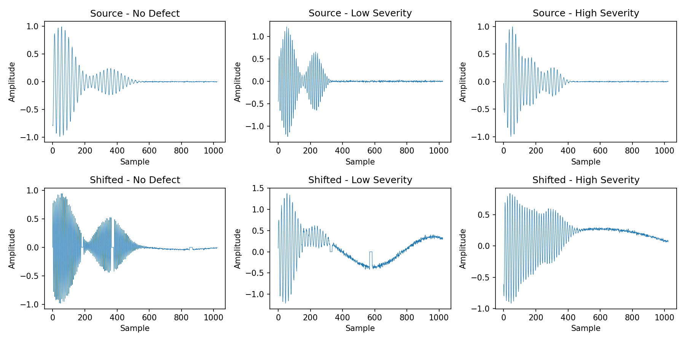
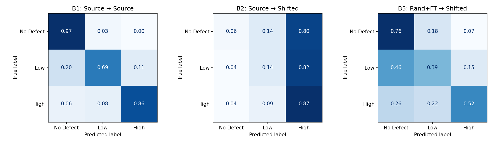
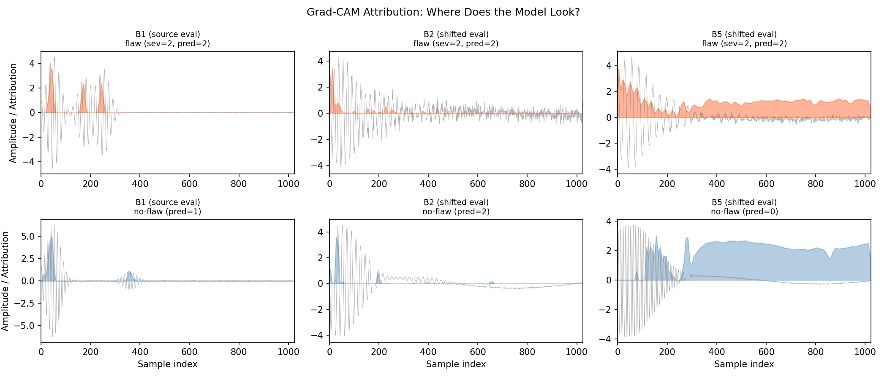
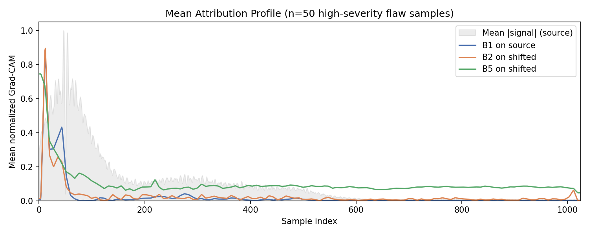
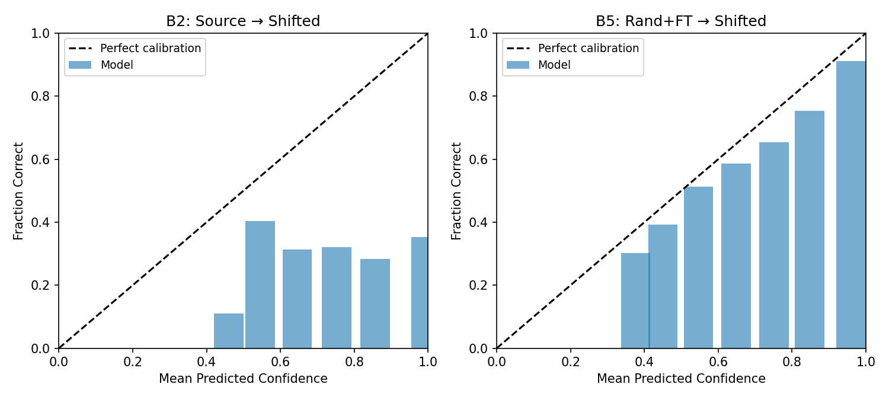
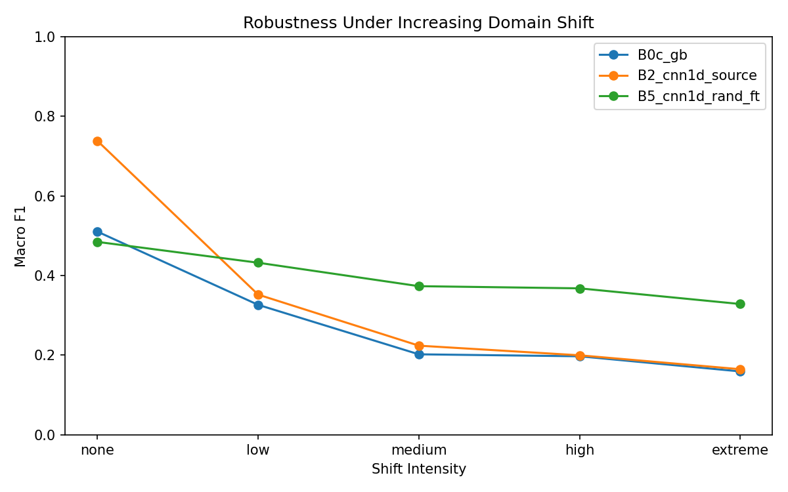
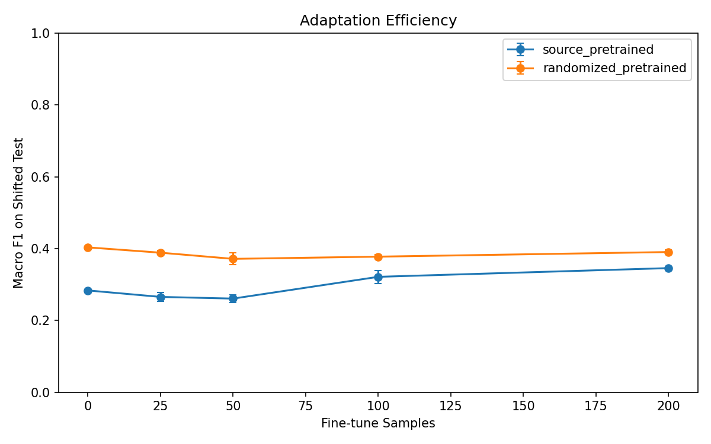
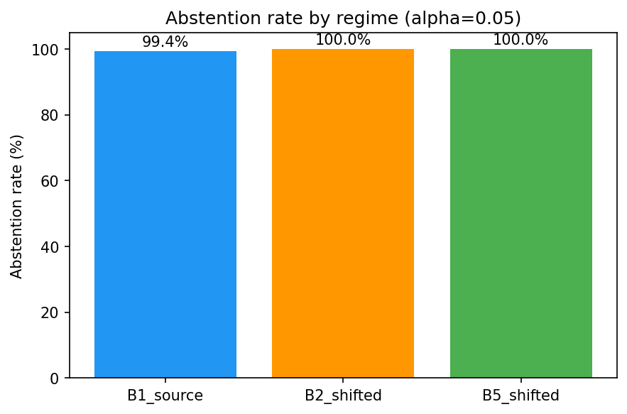
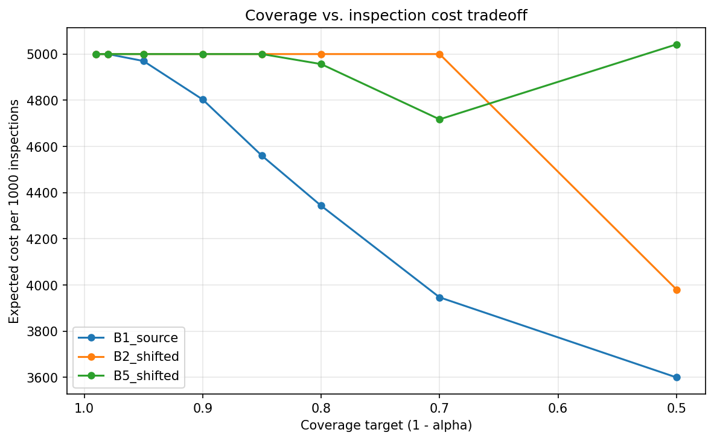

# sim-to-data

Synthetic ultrasonic inspection pipeline benchmarking defect detectors under controlled domain shift, with conformal selective prediction and cost-sensitive deployment analysis.

## Problem

Industrial ultrasonic inspection systems trained on one sensor/material configuration degrade when deployed on a different one. Real shifted data is scarce, expensive, and hard to label. This project uses a physics-based forward model to generate synthetic A-scan traces with configurable domain shift, then benchmarks how well standard detectors transfer across regimes.

## Approach

1. **Simulate**: A pulse-echo forward model generates 1D A-scan traces with surface echo, back-wall echo, and optional defect reflections. Configurable noise (Gaussian, baseline drift, gain variation, temporal jitter, masked dropout) simulates sensor degradation.
2. **Train**: A 1D CNN and non-neural baselines (logistic regression, gradient boosting) are trained on source-regime data.
3. **Shift**: A shifted regime widens material velocity, attenuation, frequency, and noise ranges to simulate deployment on a different sensor/material configuration.
4. **Adapt**: Fine-tuning on small labeled samples from the shifted regime measures adaptation efficiency.

### Example Traces

<p align="center">
  
</p>

## Results

All CNN results (B1-B5) are reported as mean ± std across 5 training seeds on a fixed dataset. Baseline models (B0a-B0c) use deterministic sklearn estimators and produce identical results on the fixed dataset.

| ID | Setup | Eval Set | Macro-F1 | AUROC | ECE |
|----|-------|----------|----------|-------|-----|
| B0a | LogReg | Source test | 0.438 | 0.635 | 0.008 |
| B0b | GradBoost | Source test | 0.510 | 0.713 | 0.045 |
| B0c | GradBoost | Shifted test | 0.225 | 0.510 | 0.460 |
| B1 | CNN | Source test | **0.837 ± 0.006** | **0.951 ± 0.003** | 0.018 ± 0.006 |
| B2 | CNN | Shifted test | 0.265 ± 0.011 | 0.538 ± 0.005 | 0.609 ± 0.010 |
| B3 | CNN (randomized) | Shifted test | **0.542 ± 0.004** | **0.738 ± 0.006** | 0.098 ± 0.032 |
| B4 | B1 + fine-tune | Shifted test | 0.368 ± 0.008 | 0.546 ± 0.006 | 0.391 ± 0.032 |
| B5 | B3 + fine-tune | Shifted test | **0.550 ± 0.005** | **0.747 ± 0.006** | 0.071 ± 0.022 |

### Key Findings

Variance reflects training randomness (initialization, batch order) on a fixed dataset, not data-sampling variance.

- **Shift hurts consistently**: B1 → B2 shows a &Delta; = -0.57 F1 drop; all 5 B2 runs fall below all 5 B1 runs (no overlap in observed ranges).
- **Randomization helps reliably**: B3 (0.542 ± 0.004) vs B2 (0.265 ± 0.011) — a stable +0.28 improvement with low variance.
- **Fine-tuning cannot recover from poor initialization**: B4 (source-pretrained + fine-tune, 0.368) underperforms B3 (randomized, no fine-tune, 0.542). The source model's features are too specialized to the source regime for 200 adaptation samples to repair.
- **Fine-tuning does not materially improve randomized performance**: B5 (0.550 ± 0.005) &asymp; B3 (0.542 ± 0.004) at 200 adaptation samples.
- **CNN justified**: The CNN substantially outperforms hand-crafted baselines on source data (B1 = 0.837 vs B0b = 0.510), justifying learned waveform features before transfer is considered.
- **Calibration**: B3/B5 have ECE &le; 0.10 while B2 has ECE = 0.61 — domain randomization produces better-calibrated models.

### Failure Mode Analysis

Under domain shift, the model collapses toward predicting high-severity for nearly all inputs. In B2, no-defect recall drops to 3%, low-severity to 18%, and high-severity inflates to 86% — the model predicts "high" regardless of true class. Domain randomization (B5) recovers no-defect recall to 75% and low-severity to 40%, though high-severity recall drops to 52% as the model distributes predictions more evenly.

Low-severity defects remain the hardest class across all conditions — the safety-critical failure pattern is that subtle defects are missed, not obvious ones.

<p align="center">
  
  <br><em>Representative seed (seed=42). Per-class recalls are consistent across all 5 training seeds.</em>
</p>

### Attribution Analysis (Grad-CAM)

Grad-CAM attributions show where the 1D CNN attends when classifying A-scan traces. On source data (B1), attribution concentrates in the early-sample region where defect echoes arrive. Under domain shift (B2), attention becomes diffuse across the trace. Domain randomization with fine-tuning (B5) produces a stronger early peak than B2, but attention remains spread across the full trace rather than cleanly re-localizing.

<p align="center">
  
  <br><em>Representative samples (seed=42). Signal in gray, Grad-CAM attribution overlaid in color.</em>
</p>

The mean attribution profile averaged over 50 high-severity flaw samples shows the same pattern: B1 (blue) peaks sharply in the early-sample region, B2 (orange) is low and diffuse, and B5 (green) peaks early but retains elevated attention across the trace.

<p align="center">
  
</p>

These are qualitative diagnostics showing where the model attends, not proof of learned physical reasoning.

### Calibration

<p align="center">
  
  <br><em>Representative seed (seed=42).</em>
</p>

B2 (source-only, shifted evaluation) is severely miscalibrated (ECE = 0.609 ± 0.010) — the model is overconfident on incorrect predictions. B5 (randomized + fine-tuned) achieves ECE = 0.071 ± 0.022, an 8.6&times; reduction in calibration error, indicating that domain randomization improves not just accuracy but also prediction trustworthiness.

### Robustness Under Increasing Shift

Robustness and adaptation results below are from a single representative seed (seed=42). Each intensity level generates a fresh test set with progressively wider parameter ranges.

<p align="center">
  
</p>

| Intensity | GradBoost | CNN (source) | CNN (rand+ft) |
|-----------|-----------|--------------|---------------|
| none | 0.510 | 0.887 | 0.721 |
| low | 0.326 | 0.398 | 0.683 |
| medium | 0.202 | 0.252 | 0.496 |
| high | 0.197 | 0.181 | 0.459 |
| extreme | 0.159 | 0.160 | 0.405 |

### Adaptation Efficiency

<p align="center">
  
</p>

| Samples | Source-pretrained F1 | Randomized-pretrained F1 |
|---------|---------------------|-------------------------|
| 0 | 0.288 | 0.544 |
| 25 | 0.362 | 0.536 |
| 50 | 0.371 | 0.545 |
| 100 | 0.362 | 0.539 |
| 200 | 0.353 | 0.547 |

Fine-tuning the source-pretrained model plateaus at F1 &asymp; 0.37 regardless of sample count (25-200) and slightly *decreases* from 50 to 200 samples, likely due to overfitting on a small fine-tune set drawn from a distribution the model's features are poorly suited for. The randomized model starts at 0.54 with zero target labels — domain randomization cannot be replaced by more target labels at this scale.

### Selective Prediction (Conformal)

Conformal prediction ([APS method](https://arxiv.org/abs/2006.02544), Romano et al. 2020) provides distribution-free coverage guarantees: the true class is included in the prediction set with probability &ge; 1 &minus; &alpha;, regardless of model quality. When the prediction set contains multiple classes, the sample is flagged for human review (abstention).

**Table A: Conformal Selective Prediction (&alpha; = 0.05, 95% coverage target)**

| Regime | Coverage | Abstention | Classified | Eff. F1 |
|--------|----------|------------|------------|---------|
| B1 (source) | 100% | 99.4% | 9 / 1500 | 1.000 |
| B2 (shifted) | 97.6% | 100% | 0 / 1500 | &mdash; |
| B5 (rand+ft) | 100% | 100% | 0 / 1500 | &mdash; |

At the standard 95% coverage level, conformal prediction correctly identifies that none of these models are confident enough for autonomous classification on most samples. With a 3-class problem and ~16% error rate even on source data, the APS threshold is driven to q&#770; &asymp; 1.0, placing all three classes into every prediction set.

Differentiation appears at relaxed coverage targets. At &alpha; = 0.30 (70% target), B5 selectively classifies 85 samples with effective F1 = 0.83, while B2 still cannot produce any useful classifications (100% abstention). At &alpha; = 0.50, B1 classifies 560 samples (F1 = 0.98), B5 classifies 249 (F1 = 0.83), and B2 classifies 326 but at F1 = 0.30 &mdash; domain shift renders even relaxed selective prediction ineffective without randomization.

<p align="center">
  
</p>

Calibration uses a 50/50 split of 3000 test-set softmax outputs per regime (single seed, seed=42). The coverage guarantee is finite-sample exact for the evaluation half given the calibration half.

### Expected Inspection Cost

An asymmetric cost matrix quantifies the deployment tradeoff: missed high-severity defects are catastrophic (cost = 500), false alarms are cheap (cost = 1), and human review of abstained samples has moderate fixed cost (cost = 5 per sample). All cost values are illustrative and would need calibration to a specific inspection context.

**Table B: Cost per 1000 Inspections at Selected Operating Points**

| Regime | &alpha; | Coverage | Abstention | Cost / 1000 | Classification Cost | Review Cost |
|--------|---------|----------|------------|-------------|--------------------:|------------:|
| B1 (source) | 0.30 | 99.9% | 78.9% | 3,947 | 0 | 5,920 |
| B1 (source) | 0.50 | 98.7% | 62.7% | 3,600 | 700 | 4,700 |
| B2 (shifted) | 0.30 | 85.9% | 100% | 5,000 | 0 | 7,500 |
| B2 (shifted) | 0.50 | 75.3% | 78.3% | 3,981 | 101 | 5,870 |
| B5 (rand+ft) | 0.30 | 97.8% | 94.3% | 4,717 | 1 | 7,075 |
| B5 (rand+ft) | 0.50 | 90.9% | 83.4% | 5,042 | 1,308 | 6,255 |

*Classification Cost and Review Cost are raw totals over the 1500-sample evaluation set; Cost / 1000 normalizes their sum to a per-1000-inspections basis.*

At &alpha; = 0.50, B5's cost (5,042) exceeds the all-review baseline (5,000) because its misclassifications include missed high-severity defects (cost = 500 each). B2 achieves lower cost (3,981) at this operating point because its few classifications avoid the most expensive errors by chance. The cost-optimal operating point for B5 is &alpha; &asymp; 0.30, where it classifies conservatively enough to avoid expensive misses while still reducing review volume.

<p align="center">
  
</p>

The key insight: F1 alone does not capture deployment readiness. Cost analysis reveals that a model with better F1 can produce more expensive errors when its misclassifications are asymmetrically costly. Selective prediction (conformal + cost) enables operators to choose an operating point that balances automation rate against worst-case inspection cost.

### Domain Adaptation Baseline (CORAL)

[CORAL](https://arxiv.org/abs/1607.01719) (Sun &amp; Saenko, 2016) aligns second-order feature statistics between source and target domains during fine-tuning. It is the simplest principled domain adaptation method &mdash; approximately 30 lines of core logic &mdash; and serves as a baseline for whether explicit alignment improves over domain randomization alone.

The experiment infrastructure is complete: `experiments/run_coral.py` fine-tunes the B3 checkpoint with CORAL loss, sweeping `coral_weight` in {0.1, 0.5, 1.0, 5.0} and selecting by validation F1. Results (B6 row) will be populated when run against the full training data.

**Expectation:** Based on the parametric nature of the shift in this simulator, CORAL is unlikely to substantially improve over B3/B5. Feature covariance alignment addresses distribution shift in learned representations, but domain randomization already forces the model to learn shift-invariant features. The honest framing: CORAL is included to demonstrate awareness of DA methods and provide a fair comparison, not because we expect it to be the answer.

### Deployment Considerations

**Conformal recalibration.** The coverage guarantee holds for the calibration distribution. Before deploying to a new inspection site, recalibrate on a small labeled sample from that site. The conformal threshold q&#770; can be updated in O(N) time without retraining the model.

**Abstention policy.** The operating point (&alpha;) should be chosen by the inspection operator based on the cost matrix for their specific context. The framework supports loading custom cost matrices from YAML (`configs/cost_matrix.yaml`).

**ONNX inference.** The best model can be exported to ONNX format for deployment without a PyTorch dependency:

```bash
# Export
python -m simtodata.export.onnx_export --checkpoint models/B5_cnn1d_randomized_finetuned.pt --output model.onnx

# Batch inference
python -m simtodata.export.onnx_infer --model model.onnx --input data/shifted_test.npz
```

ONNX export verifies numerical parity with PyTorch outputs (max absolute difference < 1e-5).

**Transferability caveat.** These results are for synthetic parametric shift (sensor/material configuration variation). The [stress test against real phased-array data](#stress-test-synthetic-b-scans-vs-real-phased-array-data) shows that the simulator's domain does not extend to real weld inspection &mdash; deployment on real data would require a fundamentally different data source, not just recalibration.

## Statistical Methodology

CNN experiments (B1-B5) are repeated across 5 random seeds controlling model initialization and training order on a fixed dataset (seed=42). Results are reported as mean ± standard deviation. Baseline models (B0a-B0c) use deterministic sklearn estimators and produce identical results on the fixed dataset.

With 5 seeds, formal significance testing has limited statistical power. We report effect sizes and consistency across runs rather than p-values. All 5 B3 runs individually outperform all 5 B2 runs (no overlap), providing strong qualitative evidence for the randomization effect.

## Related Work

Domain randomization was shown to bridge the sim-to-real gap in robotics (Tobin et al., 2017) and has theoretical grounding in domain divergence bounds (Ben-David et al., 2010). This project tests whether the same strategy transfers to ultrasonic inspection, where the shift is parametric (sensor/material variation) rather than visual. The results suggest randomization is effective for moderate parametric shift (B3 vs B2) but breaks down when the modality gap is too large (the [B-scan stress test](#stress-test-synthetic-b-scans-vs-real-phased-array-data)), consistent with findings in medical imaging that simple augmentation cannot bridge fundamental domain differences (Stacke et al., 2020).

## Stress Test: Synthetic B-Scans vs Real Phased-Array Data

As an extension, we evaluate synthetic 2D B-scans against real phased-array weld inspection data from Virkkunen et al. (2021). The modality gap is extreme (pulse-echo vs TRS shear-wave, point reflectors vs thermal fatigue cracks).

| Experiment | Eval | AUROC |
|-----------|------|-------|
| SB1 (source &rarr; source) | Synthetic | 0.923 |
| SR1 (source &rarr; real) | **Real** | 0.500 |
| SR2 (randomized &rarr; real) | **Real** | 0.176 |

**Verdict**: The model learns synthetic B-scans well but has zero discriminative ability on real data. Domain randomization does not help — it produces features that are anti-correlated with real defect presence. Full analysis: **[docs/sim_to_real.md](docs/sim_to_real.md)**

## Honest Scope

- Primary experiments use **purely synthetic data**. A [stress test against real phased-array weld data](docs/sim_to_real.md) (Virkkunen et al., 2021) is included as an extension; the extreme modality gap confirms the simulator's limits, not production readiness.
- The "domain shift" is **controlled and parametric** — real-world shift involves corrosion, coupling variation, geometry changes, and other factors not modeled here.
- **One domain adaptation baseline** (CORAL) is included for comparison. Full adaptation methods (DANN, MMD, adversarial training) are out of scope — the study focuses on domain randomization and selective prediction rather than closing the domain gap.
- The defect model is a **single point reflector** — real defects have complex geometries (cracks, porosity, delamination) that produce different echo patterns.

## Quick Start

```bash
# Install
pip install -e ".[dev]"

# Run tests
pytest tests/ -v

# Generate data + run all experiments + produce figures
python experiments/run_all.py

# Quick mode (small datasets, reduced epochs)
python experiments/run_all.py --quick

# Multi-seed benchmark (5 training seeds)
python experiments/run_multiseed.py
python experiments/aggregate_multiseed.py
```

```bash
# V3: Selective prediction + cost analysis (uses existing result JSONs)
python experiments/run_conformal.py
python experiments/run_cost_analysis.py

# V3: CORAL adaptation baseline (requires training data + B3 checkpoint)
python experiments/run_coral.py

# V3: Generate deployment-analysis figures
python experiments/generate_v3_figures.py

# ONNX export + inference
python -m simtodata.export.onnx_export --checkpoint models/B5_cnn1d_randomized_finetuned.pt --output model.onnx
python -m simtodata.export.onnx_infer --model model.onnx --input data/shifted_test.npz
```

## Makefile

```bash
make generate        # Generate synthetic datasets
make train-baselines # Run B0a-B0c baselines
make train-cnn       # Run B1-B5 CNN experiments
make evaluate        # Run robustness + adaptation sweeps
make figures         # Generate all figures
make v3              # Run V3 analysis (conformal, cost, CORAL, V3 figures)
make all             # Full pipeline
make test            # Run test suite
make lint            # Ruff lint check
make clean           # Remove generated artifacts
```

## Engineering

- **187 tests** across 24 test files (including conformal, cost, CORAL, and ONNX export tests)
- **CI**: GitHub Actions (lint + test on Python 3.10)
- **Reproducibility**: All experiment scripts seed PyTorch, NumPy, and DataLoader generators
- **Lint**: ruff, line-length 100

## Project Structure

```
sim-to-data/
├── src/simtodata/
│   ├── simulator/          # Forward model, defects, noise, regime config
│   ├── data/               # Dataset generation, PyTorch dataset, transforms
│   ├── features/           # Hand-crafted feature extraction
│   ├── models/             # CNN, baselines, training, prediction, factory
│   ├── evaluation/         # Metrics, calibration, conformal, cost framework
│   ├── adaptation/         # Domain adaptation (CORAL)
│   └── export/             # ONNX export and inference
├── configs/                # YAML configs for simulator and models
├── experiments/            # Experiment scripts, V3 analysis, figure generation
├── tests/                  # Test suite
└── Makefile
```
