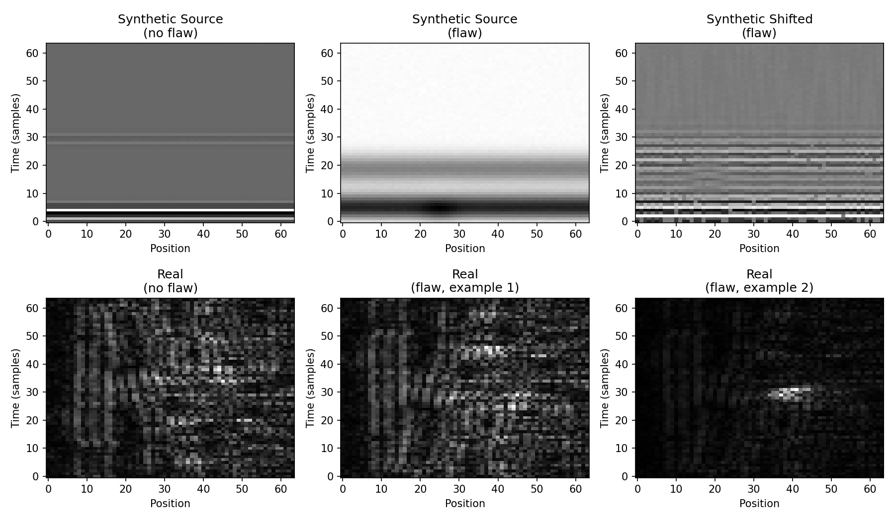
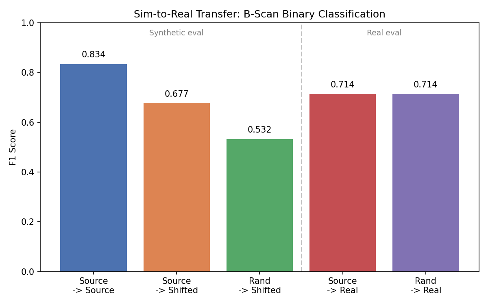

# Stress Test: Synthetic B-Scans vs Real Phased-Array Weld Data

To test whether the synthetic pipeline transfers to real measurements,
we adapt the 1D simulator to generate synthetic B-scans (stacking
adjacent A-scans with a spatial defect model) and evaluate on real
phased-array weld inspection data from Virkkunen et al. (2021).

## Modality Gap

The synthetic and real data come from fundamentally different setups:

| | Synthetic | Real (Virkkunen) |
|---|-----------|-----------------|
| Mode | Longitudinal pulse-echo | TRS phased array (shear) |
| Material | Generic metal | Austenitic 316L stainless steel weld |
| Frequency | 1.5-7.0 MHz | 1.8 MHz |
| Defect model | Point reflector | Thermal fatigue cracks |
| Noise sources | Gaussian, drift, jitter, dropout | Grain noise, mode conversion |

This is a **severe out-of-distribution stress test**, not a matched
sim-to-real validation.

<p align="center">
  
</p>

## Results

Because the real dataset is class-imbalanced (55% flaw), F1 alone is misleading here. AUROC is the main diagnostic metric for these transfer results; values at or below 0.5 indicate the model has effectively lost discriminative ability.

| Experiment | Train | Eval | F1 | AUROC |
|-----------|-------|------|----|-------|
| SB1 | Synthetic source | Synthetic source | 0.834 | 0.923 |
| SB2 | Synthetic source | Synthetic shifted | 0.677 | 0.496 |
| SB3 | Synthetic randomized | Synthetic shifted | 0.532 | 0.487 |
| SR1 | Synthetic source | **Real** | 0.714 | 0.500 |
| SR2 | Synthetic randomized | **Real** | 0.714 | 0.176 |

<p align="center">
  
</p>

## Interpretation

SB1 confirms the 2D CNN learns source-regime B-scans well (AUROC = 0.923). On shifted and real data, AUROC drops to &le; 0.5, meaning the models lose all discriminative ability. The elevated F1 values (0.68-0.71) are artifacts of class imbalance: predicting all-flaw on a 55% flaw dataset yields F1 &asymp; 0.71 with zero information content.

### Randomization does not help in the 2D setting

Unlike the 1D A-scan experiments, where synthetic randomization provided a +0.28 F1 gain (B3 vs B2), randomization does not improve B-scan transfer. SB3's AUROC of 0.487 is below 0.5, meaning the randomized model has learned features that are anti-correlated with defect presence under the shifted regime — a failure mode distinct from random guessing. This suggests the benefit of randomization in the 1D setting does not survive the much larger modality and spatial-structure gap in the 2D setting.

### Real-data results

SR1 (AUROC = 0.500) predicts P(flaw) &asymp; 1.0 for every real sample — the model is maximally confident and entirely uninformative. SR2 (AUROC = 0.176) is worse: the randomized model assigns *higher* P(flaw) to real no-flaw samples than to real flaw samples, meaning its confidence is systematically inverted on real data. This is not a label alignment bug (verified: both datasets encode flaw=1 consistently). The model has learned synthetic features that are genuinely anti-predictive on real phased-array weld data.

### What would be needed

Bridging this gap would require physics-informed simulation of shear-wave propagation, realistic grain-noise models, and calibrated transducer beam profiles — none of which are in scope for this project.

## Running the Experiments

```bash
# Synthetic-only (SB1-SB3)
python experiments/run_sim_to_real.py

# With real data (requires cloned iikka-v/ML-NDT repo)
python experiments/run_sim_to_real.py --real-data-dir /path/to/ML-NDT/data/validation

# Quick smoke test
python experiments/run_sim_to_real.py --quick

# Generate figures
python experiments/generate_sim_to_real_figures.py --real-data-dir /path/to/ML-NDT/data/validation
```
